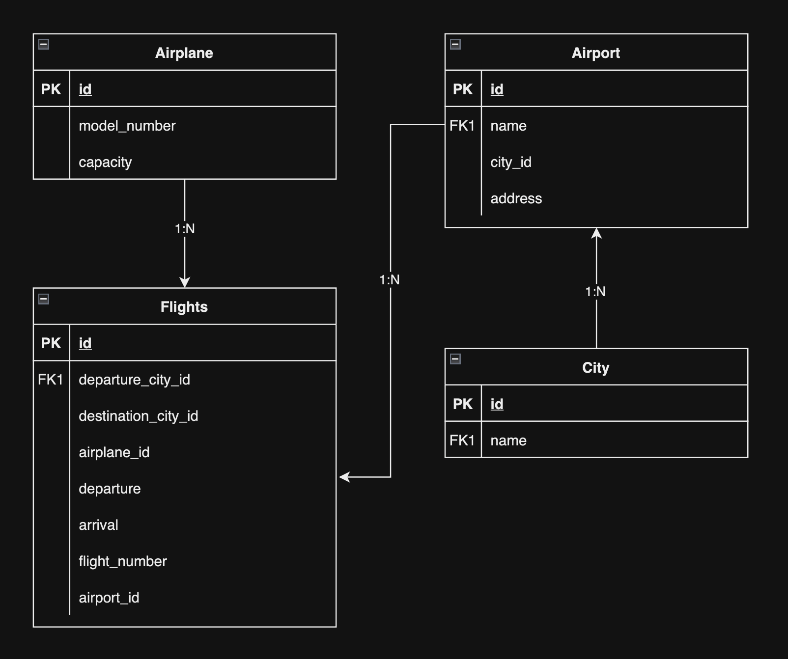

# Welcome to Flights Service

## Project Setup
- clone the project on your local
- Execute `npm install` on the same path as of your root directory of the downloaded project.
- Create a `.env` file in the root directory and add the following environment variable
    - `PORT=3000`
- Inside the `src/config` folder create a new file `config.json` and then add the following piece of json

```
{
  "development": {
    "username": <YOUR_DB_LOGIN_NAME>,
    "password": <YOUR_DB_PASSWORD>,
    "database": "Flights_Search_DB_DEV",
    "host": "127.0.0.1",
    "dialect": "mysql"
  }
}
```
- Once you've added your db config as listed above, go to the src folder from your terminal and execute `npx sequelize db:create` , and then execute 
`npx sequelize db:migrate`

- For the first time, you need to run the seeders to populate the data in the tables.
- To run the seeders, execute the following command
    - `npx sequelize db:seed:all`

- Once the above steps are done, execute `npm start` to start the server.

## DB Design
The DB design is as follows:
- There are 4 tables, `Airplanes` , `Airports` , `Cities` and `Flights`
- 

### Sequilize-cli commands
1. Model Generation
    1. City Model
        - `npx sequelize model:generate --name City --attributes name:string`
    2. Airport Model
        - `npx sequelize model:generate --name Airport --attributes name:string,address:string,cityId:integer`
    3. Airplane Model
        - `npx sequelize model:generate --name Airplane --attributes name:string`
    4. Flight Model
        - `npx sequelize model:generate --name Flight --attributes flightNumber:string,departureTime:date,arrivalTime:date,departureAirportId:integer,arrivalAirportId:integer,airplaneId:integer`
2. Migration
    - `npx sequelize db:migrate`
3. Genarate Seeder files
    1. City
        - `npx sequelize seed:generate --name add-cities`
    2. Airport
        - `npx sequelize seed:generate --name add-airports`
    3. Airplane
        - `npx sequelize seed:generate --name add-airplanes`
    4. Flight
        - `npx sequelize seed:generate --name add-flights`
4. Commands for data seeding
    1. City
        - `npx sequelize db:seed --seed 20210919120900-add-cities.js`
    2. Airport
        - `npx sequelize db:seed --seed 20210919120900-add-airports.js`
    3. Airplane
        - `npx sequelize db:seed --seed 20210919120900-add-airplanes.js`
    4. Flight
        - `npx sequelize db:seed --seed 20210919120900-add-flights.js`